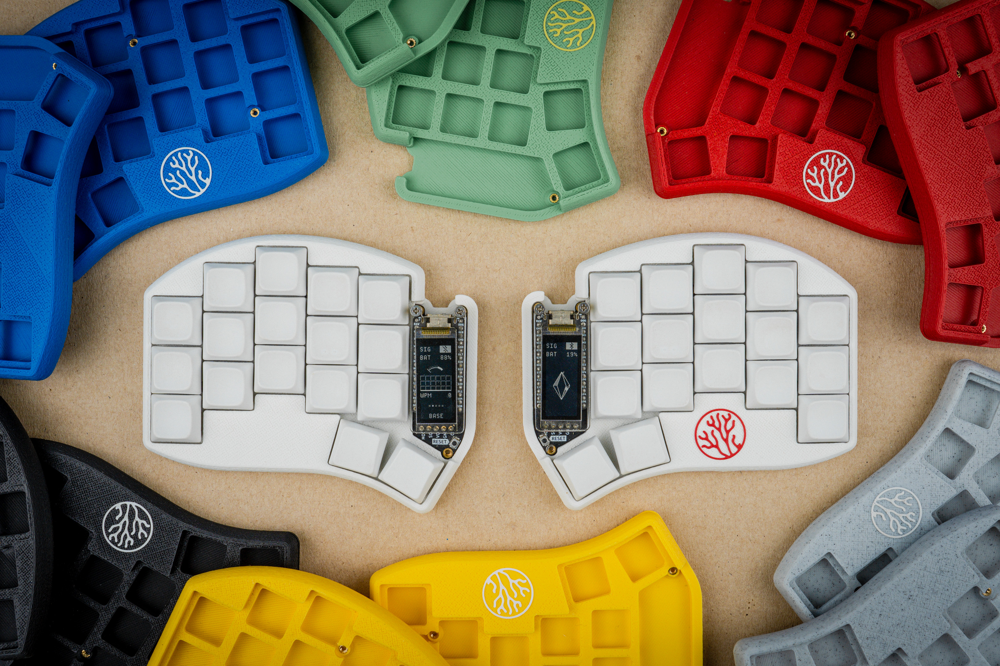
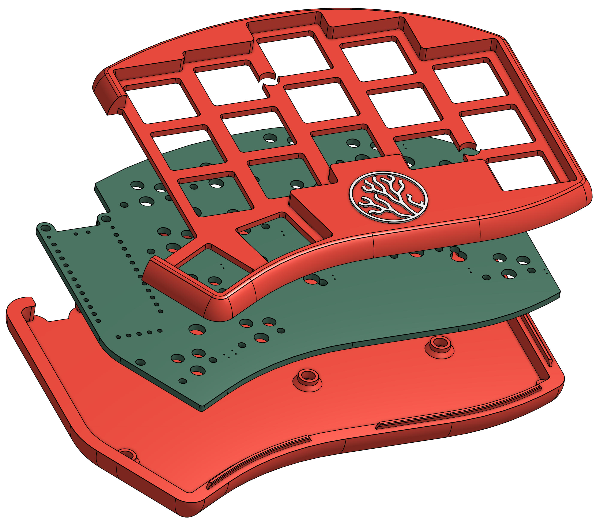

# Urchin 🪸

  
  
  
   
  

I created this design because I wanted to upgrade my [Sweep](https://github.com/davidphilipbarr/Sweep) with the fancy nice!view displays. I decided to use the edge design from the [Swoop](https://github.com/jimmerricks/swoop) and to make it compatible with Kailh hotswap sockets.
**This is a strictly wireless-only design, and is only compatible with ZMK / nice!nano. Only Choc v1 switches + Hotswap are supported!**

> Q: Why is this not just another Sweep?
> _A: In order to support the nice!view display I had to use a switch matrix with diodes instead of the Sweep's direct pin design. This means that the firmwares are not interchangeable. I also wanted to use a different PCB shape which makes it incompatible with Sweep cases._

**If you enjoy my work, please consider ⭐ starring and/or ❤ sponsoring it.**

## Sponsors

_Support the people that support me!_ 🙏🏻

  
  

## Features

- [x] Design fully optimized for wireless
- [x] Native nice!view support
- [x] Familiar Ferris/Sweep layout
- [x] Improved outline shape
- [x] Support for Kailh hotswap sockets
- [x] Mounting points for cases
- [x] 3D printable enclosure case
- [x] Switch Plate files (3 options)
- [x] MCU/Screen Cover files

## Part list (for a full keyboard)

#### Required

- 1× PCB Kit (files for it are in [releases](https://github.com/duckyb/urchin/releases))
- 34× Kailh **CHOC** Hotswap Sockets
- 34× Kailh Choc v1 Switches
- 34× Keycaps
- 34× SMD diodes (SOD-123)
- 2× nice!nano
- 2× Lipo battery (301230)
- 48× mill-max machined pins
- 2× Pair of female headers

#### Optional

- 2× nice!view
- 2× Reset switch (B3U-1000P(M))
- 2× Power switch (MSK 12C02)
- 10× adhesive silicone feet

#### Case (NEW!)

| Coral Case                                         | Description                                                                                                                                                                                             |
| -------------------------------------------------- | ------------------------------------------------------------------------------------------------------------------------------------------------------------------------------------------------------- |
|  | The official Coral case is available on [Makerworld](https://makerworld.com/en/models/1057239#profileId-1044921) (for free). Other cases can be found in this repository inside the `3d-prints` folder. |

> [!NOTE]  
> Installing a case, microcontroller cover, or screen acrylic cover will require additional M2 hardware not included in this list. (Like screws, standoffs, nuts, heat set inserts)

## How do I make this?

## Firmware

Urchin supports ZMK only. To get started with ZMK visit the [zmk-urchin repository](https://github.com/duckyb/zmk-urchin) and follow the provided instructions.

## More videos about Urchin

- https://www.youtube.com/watch?v=o2W_uG-OBjk

## Credits

- PCB edge design by [jimmerricks](https://github.com/jimmerricks/swoop)
- Coral, rocks, sand & bubbles by [Kneecrust](https://linktr.ee/kneecrust)
- The development name "Swipe Light" by [Pete](https://github.com/petejohanson)
- Nice!view integration reference: [sadekbaroudi/sweep36](https://github.com/sadekbaroudi/sweep36)
- ZMK Firmware help by [Mabroum](https://github.com/AlaaSaadAbdo) & [Bravekarma](https://github.com/caksoylar)
- Silkscreen labels style: [bastardkb/dilemma](https://github.com/Bastardkb/Dilemma)
- 3d case by [iamDrakkir](https://github.com/iamDrakkir)
- 3d case by [chewiedies](https://www.printables.com/it/social/360738-chewiedies/about)
- 3d case by [carrefinho](https://github.com/carrefinho)
- Coral logo idea by exosr on discord
